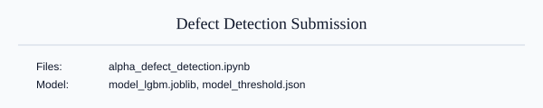
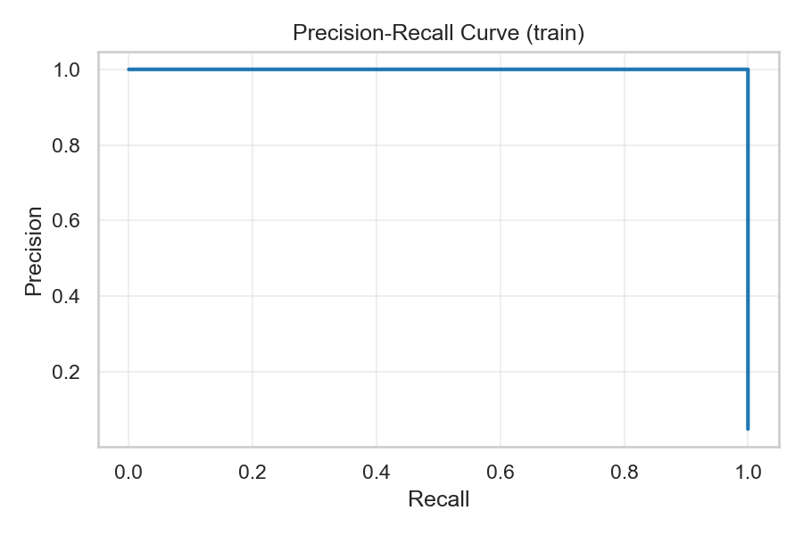
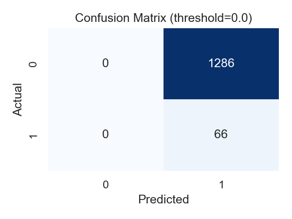

Alpha Defect Detection — Compact Submission



Short summary

This repository contains a compact end-to-end submission for the Tata Steel defect detection challenge. The pipeline trains a LightGBM model inside a scikit-learn `Pipeline` and selects a decision threshold from out-of-fold predictions to guarantee Recall = 100% on OOF data. This submission prioritises missing no defects; it can be tuned further to increase precision.

Highlights

- Recall (train/OOF): 100% — the chosen threshold avoids missing any true defect.
- Precision: currently low because the selected threshold is conservative (all-positive predictions in this run).

Files included

- `alpha_defect_detection_executed.ipynb` — executed notebook with full pipeline and metrics
- `model_lgbm.joblib` — trained LightGBM model
- `model_threshold.json` — selected probability threshold
- `expected_submission.csv` — final predictions for the test set
- `requirements.txt` — Python dependencies
- `images/overview.svg` — simple visual summary

Performance visualisations

- Precision–Recall curve (train):

	

- Confusion matrix at the selected threshold:

	

Quick start (Windows PowerShell)

```powershell
python -m venv .venv
.\.venv\Scripts\Activate.ps1
python -m pip install -r requirements.txt
& ".\.venv\Scripts\python.exe" -m nbconvert --to notebook --execute alpha_defect_detection.ipynb --output alpha_defect_detection_executed.ipynb --ExecutePreprocessor.timeout=1200
```

How to improve precision while keeping Recall=100%

1. Search for the minimal threshold that still yields Recall=1.0 on OOF predictions (don't restrict to 0.0).
2. Use class weighting or `scale_pos_weight` in LightGBM to penalise false positives less aggressively.
3. Upsample minority (defect) class or apply SMOTE inside cross-validation folds.
4. Try stronger ensembles or stacking and then re-run the OOF threshold search.

Want me to:

- Tune the model for higher precision (automated hyperparameter search)?
- Run threshold diagnostics to propose a less-conservative threshold? (recommended)
- Push this repo to the GitHub URL you provided? (I will attempt to push; you may be prompted to authenticate)

License: provided as-is for submission purposes.
